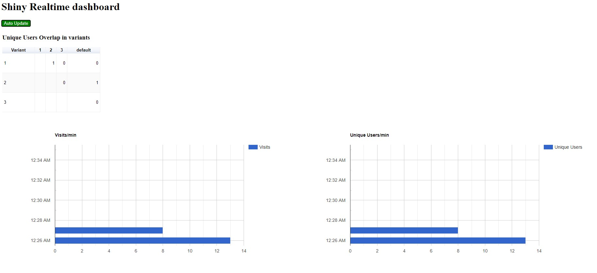

## Realtime Analytics using Dataflow and Cloud Memorystore (Redis)

In today’s fast-paced world, there is emphasis on getting instant insights.
Typical use-cases involve SaaS operators providing real-time metrics for their KPIs
or marketeers' need for quick insights on performance of their offers or experiments on the website.

This solution will demonstrate how to build a real-time website analytics dashboard on GCP.


### Components

**User events / Message bus** provides system decoupling, [Pub/Sub](https://cloud.google.com/pubsub)
 is a fully managed message/event bus and provides an easy way to handle the fast click-stream 
 generated by typical websites. The click-stream contains signals which can be processed to derive 
 insights in real time. 

**Metrics processing pipeline** is required to process the click-stream from Pub/Sub into the 
 metrics database. [Dataflow](https://cloud.google.com/dataflow) will be used, which is a 
 serverless, fully managed processing service supporting real-time streaming jobs. 

**Metrics Database**, needs to be an in-memory database to support real-time use-cases. 
 Some common web analytic metrics are unique visitors, number of active experiments, conversion rate 
 of each experiment, etc. The common theme is to calculate uniques, i.e. Cardinality counting, 
 although from a marketeer's standpoint a good estimation is sufficient, the 
 [HyperLogLog](https://en.wikipedia.org/wiki/HyperLogLog) algorithm is an efficient solution to the 
 count-unique problem by trading off some accuracy.
  
[Cloud Memorystore (Redis)](https://cloud.google.com/memorystore/docs/redis/redis-overview) provides 
 a slew of in-built functions for sets and cardinality measurement, alleviating the need to perform 
 them in code. 
 
The analytics reporting and visualization makes the reports available to the marketeer easily. 
A **Spring dashboard application** is used for demo purposes only. The application uses 
[Jedis](https://github.com/xetorthio/jedis) client to access metrics from Redis using 
[`scard`](https://redis.io/commands/scard) and 
[`sinterstore`](https://redis.io/commands/sinterstore) commands for identifying user overlap and 
other cardinality values. It then uses Javascript based web-ui to render graphs using 
[Google Charts](https://developers.google.com/chart) library.

## Video Tutorial
| Part 1 | Part 2 |
| ------ | ------ |
| [](https://www.youtube.com/watch?v=7NvgleOy480) | [](https://www.youtube.com/watch?v=FyDNn7gZNi4) |

## Quick Start
[](https://console.cloud.google.com/cloudshell/editor?cloudshell_git_repo=https://github.com/GoogleCloudPlatform/redis-dataflow-realtime-analytics.git)

### Setup Environment
1. Clone this repository
    ```shell script
    git clone https://github.com/GoogleCloudPlatform/redis-dataflow-realtime-analytics.git
    cd redis-dataflow-realtime-analytics
    ```
2. Update and activate all environment variables in `set_variables.sh`
    ```shell script
    source set_variables.sh
    ```
3. Enable required Cloud products
    ```shell script
    gcloud services enable \
    compute.googleapis.com \
    pubsub.googleapis.com \
    redis.googleapis.com \
    dataflow.googleapis.com \
    storage-component.googleapis.com
    ```
### Create Pub/Sub Topic
Pub/Sub is a global message bus enabling easy message consumption in a decoupled fashion.
Create a Pub/Sub topic to receive application instrumentation messages
```shell script
gcloud pubsub topics create $APP_EVENTS_TOPIC --project $PROJECT_ID
```
### Create VPC network
Protecting the Redis instance is important as it  does not provide any protections from external entities.

1. Creating a sepate VPC network with external ingress blocked by a firewall provides basic security for the instance.   
    ```shell script
    gcloud compute networks create $VPC_NETWORK_NAME \
    --subnet-mode=auto \
    --bgp-routing-mode=regional
    ```
2. Create Firewall rule to enable SSH
    ```shell script
    gcloud compute firewall-rules create allow-internal-ssh \
    --network $VPC_NETWORK_NAME \
    --allow tcp:22,icmp
    ```
   
### Configure Cloud Memorystore
[Cloud Memorystore](https://cloud.google.com/memorystore) provides a fully managed [Redis](https://redis.io/) database.
Redis is a NoSQL In-Memory database, which offers comprehensive in-built functions for
 [SETs](https://redis.io/commands#set) operations, 
 including efficient HLL operations for cardinality measurement. 

1. Create Redis instance in Memorystore. 
    ```shell script
    gcloud redis instances create $REDIS_NAME \
    --size=1 \
    --region=$REGION_ID \
    --zone="$ZONE_ID" \
    --network=$VPC_NETWORK_NAME \
    --tier=standard
    ```
   > Be patient, this can take some time.
2. Capture instance's IP to configure the Dataflow and Visualization application 
    ```shell script
    export REDIS_IP="$(gcloud redis instances describe $REDIS_NAME --region=$REGION_ID \
   | grep host \
   | sed 's/host: //')"
    ```

### Start Analytics pipeline
The analytic metrics pipeline will read click-stream messages from Pub/Sub and update metrics in the Redis database in real-time. The visualization application can then use the Redis database for the dashboard.

1. Create Cloud Storage bucket for temporary and staging area for the pipeline
    ```shell script
    gsutil mb -l $REGION_ID -p $PROJECT_ID gs://$TEMP_GCS_BUCKET
    ```
2. Launch the pipeline using [Maven](https://apache.org/maven)
    ```shell script
    cd processor
    ``` 
    ```shell script
    mvn clean compile exec:java \
      -Dexec.mainClass=com.google.cloud.solutions.realtimedash.pipeline.MetricsCalculationPipeline \
      -Dexec.cleanupDaemonThreads=false \
      -Dmaven.test.skip=true \
      -Dexec.args=" \
    --streaming \
    --project=$PROJECT_ID \
    --runner=DataflowRunner \
    --stagingLocation=gs://$TEMP_GCS_BUCKET/stage/ \
    --tempLocation=gs://$TEMP_GCS_BUCKET/temp/ \
    --inputTopic=projects/$PROJECT_ID/topics/$APP_EVENTS_TOPIC \
    --workerMachineType=n1-standard-4 \
    --region=$REGION_ID \
    --subnetwork=regions/$REGION_ID/subnetworks/$VPC_NETWORK_NAME \
    --redisHost=$REDIS_IP \
    --redisPort=6379"
    ```

### Start the dummy website events generator
The dummy event generator is a Python executable, which needs to keep running, this can be achieved by launching the generator in a __separate shell session__.

1. Create and initialize a new python3 virtual environment (you need to have `pyhton3-venv` package)
    ```shell script
    python3 -m venv ~/generator-venv
    source ~/generator-venv/bin/activate  
    pip install -r loggen/requirements.txt   
    ```
2. Run the logs generator
    ```shell script
    python loggen/message_generator.py \
    --topic $APP_EVENTS_TOPIC \
    --project-id $PROJECT_ID \
    --enable-log true
    ```

### Run the Visualization Engine
Use the simple reporting application located in `dashboard/` folder, built using SpringBoot and simple HTML+JS based UI.  

The application reads the metrics from the Redis database and makes it available to the dashboard UI.
The Application server needs to be on the same VPC network as the Redis server, to achieve this for demo purposes, 
we will use a Proxy VM to tunnel the ports to Cloud Shell VM, as its not on the same network.
 
1. Create a VM to act as proxy
    ```shell script
    gcloud compute instances create proxy-server \
    --zone $ZONE_ID \
    --image-family debian-10 \
    --image-project debian-cloud \
    --network $VPC_NETWORK_NAME
    ```   
2. Start SSH port forwarding
    ```shell script
    gcloud compute ssh proxy-server --zone $ZONE_ID -- -N -L 6379:$REDIS_IP:6379 -4 &
    ```
3. Start the Visualization Spring boot application.
    ```shell script
    cd dashboard/
    mvn clean compile package spring-boot:run
    ```
4. Click on the  icon to open [web preview](https://cloud.google.com/shell/docs/using-web-preview),
 to access the application's web-ui in the browser.
 
   a. Click "Preview on port 8080"   
   b. On the dashboard, click "Auto Update" which will keep the dashboard fresh.
 
 __Sample Dashbaord__
 
